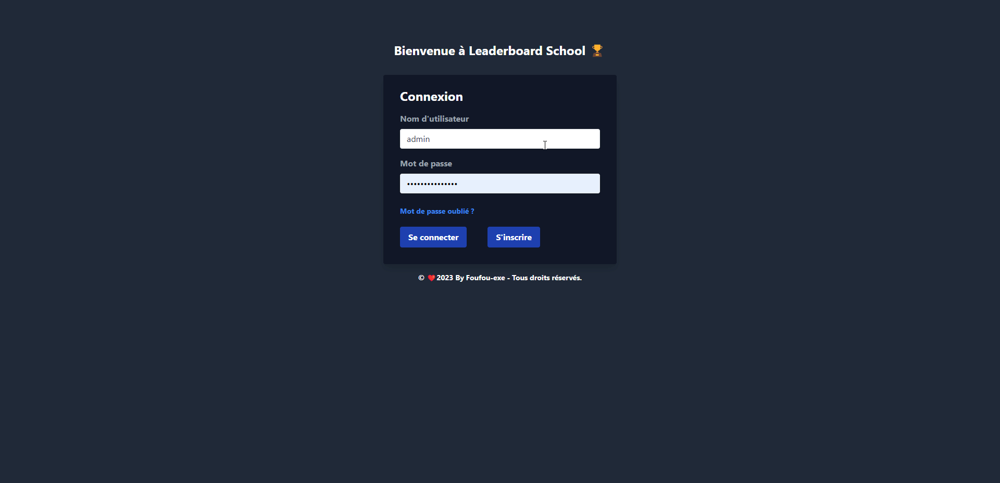

<div align="center">
    
    <h4>Site Web utilisant <a href="https://flask.palletsprojects.com/en/2.2.x/" target="_blank">Flask</a> et <a href="https://www.mongodb.com/compatibility/mongodb-and-django" target="_blank">MongoDB</a></h4>
    <p>Tableau de Score en direct</p>
</div>

## Description 🍀

Leaderboard Game School est un site web conçu avec Django et MongoDB qui permet d'afficher les classements des joueurs en fonction de leurs performances dans différents jeux. Les statistiques des joueurs sont également affichées, permettant aux utilisateurs de comparer leurs performances avec celles des autres joueurs. Les jeux proposés peuvent varier selon les préférences de l'administrateur du site, et les joueurs peuvent s'inscrire pour participer au concours.  Leaderboard Game School est conçu pour offrir une expérience de jeu compétitive et amusante aux joueurs de tous niveaux.

## Tâches 👍

- [x] Afficher le classement des joueurs ainsi que leurs statisques
- [x] Créer une page d'authentifcation d'Utilisateur
- [x] Créer des Catégories de Jeux

## Installation 🌱

Pour faire fonctionner l'application, vous devrez installer les bibliothèques nécessaires listées dans le fichier requirements.txt. Vous pouvez les installer en utilisant pip:

```python
pip install -r requirements.txt
```

## Usage

Pour lancer l'application, utilisez la commande suivante:

```cmd
python app.py
```

## Démo 🖥️



## Code ⚙️

### Langages 📖

- Python
- HTML
- CSS
- NoSQL

### Frameworks

- Flask
- Tailwind

### Services

- MongoDB
- Flask

### Structure SQL 🎈
##### MCD


#### Création BDD


##### Script SQL

Petit exemple de la structure en SQL

<details>

```sql
CREATE TABLE _User(
   id_user INT,
   username VARCHAR(255) NOT NULL,
   password VARCHAR(255) NOT NULL,
   email VARCHAR(255) NOT NULL,
   PRIMARY KEY(id_user),
   UNIQUE(username),
   UNIQUE(password),
   UNIQUE(email)
);

CREATE TABLE Jeux(
   id_jeux VARCHAR(50),
   name VARCHAR(255) NOT NULL,
   PRIMARY KEY(id_jeux),
   UNIQUE(name)
);

CREATE TABLE Partie(
   id_partie INT,
   _date DATE NOT NULL,
   id_jeux VARCHAR(50) NOT NULL,
   PRIMARY KEY(id_partie),
   UNIQUE(_date),
   FOREIGN KEY(id_jeux) REFERENCES Jeux(id_jeux)
);

CREATE TABLE User_Partie(
   id_partie INT,
   id_user INT,
   score INT,
   PRIMARY KEY(id_partie, id_user),
   FOREIGN KEY(id_partie) REFERENCES Partie(id_partie),
   FOREIGN KEY(id_user) REFERENCES _User(id_user)
);


```

</details>

##### Script NoSQL

Petit exemple de la structure en NoSQL

<details>

```NoSQL
db.createCollection("_User", {
   validator: {
      $jsonSchema: {
         bsonType: "object",
         required: ["username", "password", "email"],
         properties: {
            id_user: {
               bsonType: "objectId"
            },
            username: {
               bsonType: "string"
            },
            password: {
               bsonType: "string"
            },
            email: {
               bsonType: "string"
            }
         },
         uniqueItems: ["username", "password", "email"]
      }
   }
})

db.createCollection("Jeux", {
   validator: {
      $jsonSchema: {
         bsonType: "object",
         required: ["name"],
         properties: {
            id_jeux: {
               bsonType: "objectId"
            },
            name: {
               bsonType: "string"
            }
         },
         uniqueItems: ["name"]
      }
   }
})

db.createCollection("Partie", {
   validator: {
      $jsonSchema: {
         bsonType: "object",
         required: ["_date", "id_jeux"],
         properties: {
            id_partie: {
               bsonType: "objectId"
            },
            _date: {
               bsonType: "date"
            },
            id_jeux: {
               bsonType: "objectId",
               ref: "Jeux"
            }
         },
         uniqueItems: ["_date"]
      }
   }
})

db.createCollection("User_Partie", {
   validator: {
      $jsonSchema: {
         bsonType: "object",
         required: ["id_partie", "id_user", "score"],
         properties: {
            id_partie: {
               bsonType: "objectId",
               ref: "Partie"
            },
            id_user: {
               bsonType: "objectId",
               ref: "_User"
            },
            score: {
               bsonType: "int"
            }
         }
      }
   }
})
```

</details>

## Fonctionnalités 📖

L'application permet aux utilisateurs de s'inscrire et de se connecter à leur compte. Une fois connectés, les utilisateurs peuvent consulter le classement des différents jeux et enregistrer leurs scores pour chaque jeu. L'application fournit également des statistiques de jeu pour chaque utilisateur, indiquant le nombre de victoires et de défaites pour chaque jeu.

## Architecture de l'application 🔍

L'application est construite à l'aide de Flask, un framework web léger pour Python. Elle utilise MongoDB pour le stockage des données et Flask-Login pour l'authentification des utilisateurs. L'application est conçue pour être facilement extensible, avec la possibilité d'ajouter de nouveaux jeux et de nouvelles fonctionnalités en fonction des besoins. Le code est bien organisé et commenté pour faciliter la maintenance et les développements futurs.

## Auteur 🚀

[@Foufou-exe](https://github.com/Foufou-exe)
