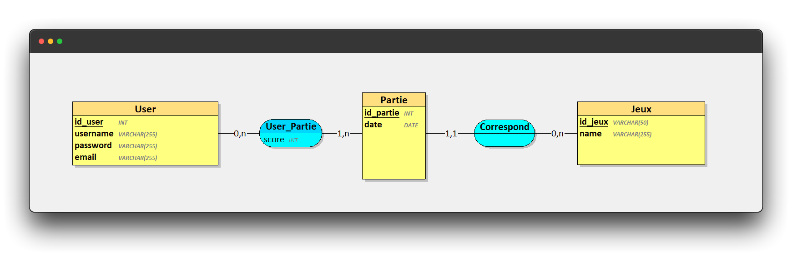

<div align="center">
    
    <h4>Site Web utilisant <a href="https://flask.palletsprojects.com/en/2.2.x/" target="_blank">Flask</a> et <a href="https://www.mongodb.com/compatibility/mongodb-and-django" target="_blank">MongoDB</a></h4>
    <p>Tableau de Score en direct</p>
</div>

## Description 🍀

Leaderboard Game School est un site web conçu avec Django et MongoDB qui permet d'afficher les classements des joueurs en fonction de leurs performances dans différents jeux. Les statistiques des joueurs sont également affichées, permettant aux utilisateurs de comparer leurs performances avec celles des autres joueurs. Les jeux proposés peuvent varier selon les préférences de l'administrateur du site, et les joueurs peuvent s'inscrire pour participer au concours.  Leaderboard Game School est conçu pour offrir une expérience de jeu compétitive et amusante aux joueurs de tous niveaux.

## Tache 👍

- [ ] Afficher le classement des joueurs ainsi que leurs statisques
- [ ] Créer une page d'authentifcation d'Utilisateur
- [ ] Créer des Catégories de Jeux
- [ ] Réagir au Classements des personnes

## Démo 🖥️

_Bientôt..._

## Code ⚙️

### Langages 📖

- Python
- HTML
- CSS
- NoSQL

### Frameworks

- Flask

### Services

- MongoDB

### Structure SQL 🎈
##### MCD



#### Création BDD


##### Script SQL

Petit exemple de la structure en SQL

<details>

```sql
CREATE TABLE Utilisateur(
   id_user INT,
   scoreTotal INT NOT NULL,
   Finalposition INT NOT NULL,
   PRIMARY KEY(id_user),
   UNIQUE(scoreTotal),
   UNIQUE(Finalposition)
);

CREATE TABLE Partie(
   id_partie INT,
   partie INT NOT NULL,
   _date DATE NOT NULL,
   _position INT NOT NULL,
   name VARCHAR(255) NOT NULL,
   score BIGINT NOT NULL,
   PRIMARY KEY(id_partie),
   UNIQUE(partie),
   UNIQUE(_date),
   UNIQUE(_position),
   UNIQUE(name),
   UNIQUE(score)
);

CREATE TABLE Connexion(
   id_connexion INT,
   username VARCHAR(255) NOT NULL,
   password VARCHAR(255) NOT NULL,
   email VARCHAR(255) NOT NULL,
   PRIMARY KEY(id_connexion),
   UNIQUE(username),
   UNIQUE(password),
   UNIQUE(email)
);

CREATE TABLE UtilisateurJouePartie(
   id_user INT,
   id_partie INT,
   PRIMARY KEY(id_user, id_partie),
   FOREIGN KEY(id_user) REFERENCES Utilisateur(id_user),
   FOREIGN KEY(id_partie) REFERENCES Partie(id_partie)
);

CREATE TABLE ConnexionAppartient(
   id_user INT,
   id_connexion INT,
   PRIMARY KEY(id_user, id_connexion),
   FOREIGN KEY(id_user) REFERENCES Utilisateur(id_user),
   FOREIGN KEY(id_connexion) REFERENCES Connexion(id_connexion)
);


```

</details>

##### Script NoSQL

Petit exemple de la structure en NoSQL

<details>

```NoSQL
Utilisateur :
{
id_user: INTEGER,
scoreTotal: INTEGER,
Finalposition: INTEGER
}

Partie :
{
id_partie: INTEGER,
partie: INTEGER,
date: DATE,
position: INTEGER,
name: STRING,
score: BIGINT
}

Connexion :
{
id_connexion: INTEGER,
username: STRING,
password: STRING,
email: STRING
}

UtilisateurJouePartie :
{
id_user: INTEGER,
parties: [
{
id_partie: INTEGER,
score: BIGINT,
position: INTEGER,
date: DATE
}
]
}

ConnexionAppartient :
{
id_user: INTEGER,
connexions: [
{
id_connexion: INTEGER,
username: STRING,
password: STRING,
email: STRING
}
]
}
```

</details>